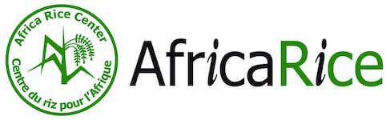
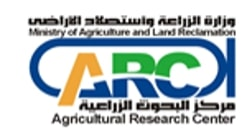
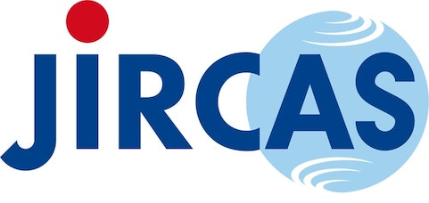
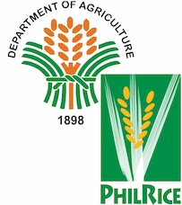
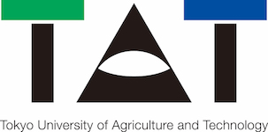
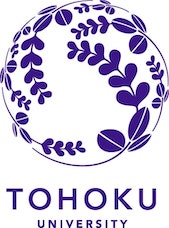

# HOJO Official Document

## What is HOJO?

HOJO is an app designed to keep track of the growth status of crops. Users can manage the associated images, dates, and location information, making it possible to obtain growth profiles in large-scale fields or to support the work of field workers who wish to investigate differences between fields in various regions.

## Privacy Policy

- <https://github.com/r1wtn/HOJO-docs/blob/main/docs/PRIVACY_POLICY.md>

## Contact

Please contact contact.r1.technologies@gmail.com for any questions, requests, or other inquiries regarding the app.

## Acknowledgments

This project is made possible by the generous contributions of the following organizations and individuals. (in alphabetical order)

  

