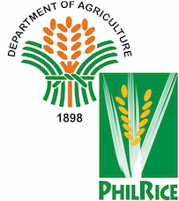

# HOJO Official Document

## What is HOJO?

HOJOは作物の生育の様子を記録しておくためのアプリです。
画像・日時・位置情報を紐付けて管理できるため、大規模な圃場での生育プロファイルを取りたいユーザーや、様々な地域での圃場間差異を調査したいフィールドワーカーの仕事をサポートできます。

## Privacy Policy

- <https://github.com/r1wtn/HOJO-docs/blob/main/docs/PRIVACY_POLICY_ja.md>

## 謝辞

本プロジェクトは、以下の皆様を始めとする、国内・国外の様々な研究機関・研究者の方々の多大な貢献のもとに成り立っています。（アルファベット順）

### Organizations

- [AfricaRice](https://www.africarice.org/)  
  
- [Egypt Agricultural Research Center](http://www.arc.sci.eg/default.aspx?lang=en)  

<!-- - [国立大学法人東海国立大学機構 岐阜大学](https://www.gifu-u.ac.jp/en/)  

- [国際農研](https://www.jircas.go.jp/en)  
 -->
- [Philippine Rice Research Institute](https://www.philrice.gov.ph/)  

- [RECS International. Inc](https://recs-intl.co.jp/en)  

<!-- - [国立大学法人 東京農工大学](https://www.tuat.ac.jp/)  
  
- [国立大学法人 東北大学](https://www.tohoku.ac.jp/en/)  
 -->

### Individuals

- [田中 佑](https://twitter.com/YuTanaka6400)
  - 岡山大学 作物生産技術学研究室 准教授
- [中嶌 洸太](https://twitter.com/kn100306)
  - Kyoto University, Graduate school of agriculture, Ph.D. 2nd
